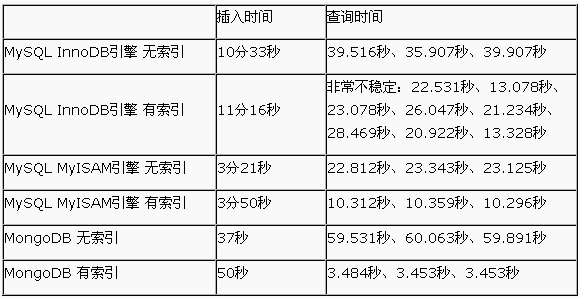
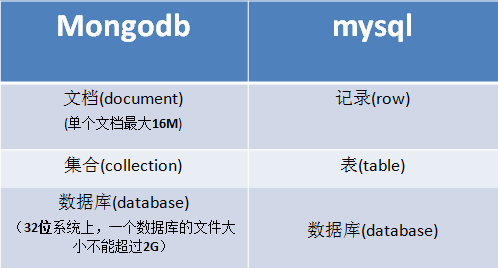

# 1、基本简介
    MongoDB 是一个介于关系数据库和非关系数据库之间的产品，是非关系数据库当中功能最丰富，最像关系数据库的，语法有点类似javascript面向对象的查询语言，它是一个面向集合的，模式自由的文档型数据库。
    它的特点是高性能、易部署、易使用，存储数据非常方便。

    （1）主要目标：高的性能，扩展强（分布式存储）
    （2）面向文档的数据库
    （4）以bson格式存储数据
    （5）javascript作为操作语言
    （6）支持多种语言：php python java c++等
    （7）支持GridFs(大文件存储)

# 2、mongodb与mysql性能比较

    分别插入100万条记录，并对其做100个用户并发查询操作

# 3.基本概念

## 1、文档
    文档是，mongodb里面数据存储的基本单元，类似关系数据库的行，
    多个键值对有序地放置在一起便是一个文档。
    {name:’李黑’,age:12,email:’nihao@sohu.com’}
    {name:’李小黑’,age:10,email:’小黑@sohu.com’,sex:男,height:167}

    	{ “username”:”Tom”, “age”:10 }
        { "Username":"Tom" , "age" : "10" }
    注意：
    （1）以上是两个不同的文档，MongoDB区分大小写的数据类型，第一个age字段是数字类型，第二个age是字符串类型。
    （2）每一个文档尺寸不能超过16M

## 2、集合
    多个文档在组成一个集合，集合就类似于关系型数据库里面的表。

    无模式是指，在同一个集合中可以包含不同格式的文档，如：
    {   "Name" : "Mongodb" ,  "Type" : "Nosql"  }
    {   "UserName" : "Tom"  ,  "age"  :  20  ,  "Gender"  :  "male"  }
    以上两个文档可以放在同一个集合中。
    在Mysql需要先建表再插入数据，
    模式自由（schema-free）：意思是集合里面没有行和列的概念，
    MongoDB中的集合不用创建、没有结构，所以可以放不同格式的文档。

## 3、数据库
    多个集合可以组成数据库。一个mongoDB实例可以承载多个数据库，他们之间完全独立。
    Mongodb中的数据库和Mysql中的数据库概念类似，只是无需创建。
    一个数据库中可以有多个集合。
    一个集合中可以有多个文档。

# 4、基本操作命令
    1、创建数据库，
    语法：
    use   数据库名称
    如果数据库不存在，则是创建，如果数据库已经存在，则是切换，如果创建了没有任何的添加操作，则会自动删除该数据库。

    2、查看数据库
    语法：
    show   dbs

    3、创建集合，
    集合是隐式创建，在添加数据时会自动创建。
    db.集合名.insert({文档数据})
    db表示当前数据库，就类似于面向对象里面的this

    向集合里面添加数据：
    db. 集合名称.insert({键1：值1，键2：值2……..})

    4、查看当前数据库下面的集合
    语法：
    show tables

    5、删除当前数据库下的某个集合
    语法：
    db.集合名.drop()

    6、删除数据库
    语法：
    db.dropDatebase()

    7、帮助命令
    在数据库级别下查看帮助命令
    语法：
    db.help()

    在集合级别的帮助命令
    语法：db.集合名.help()
